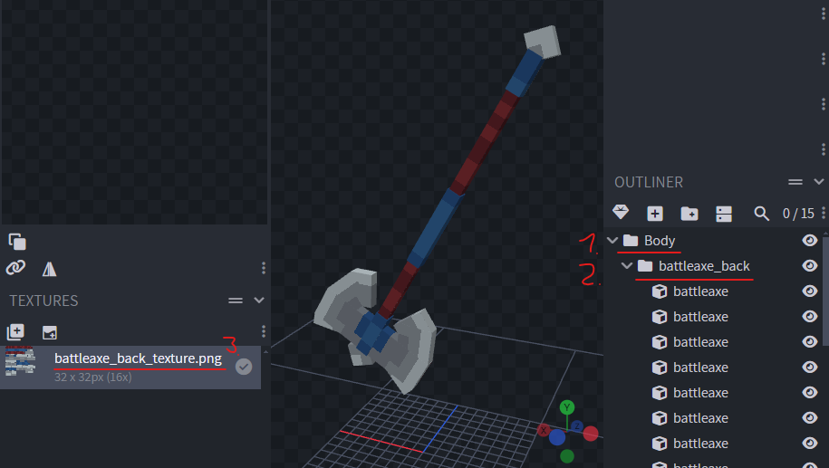

# Model Parts
> A small guide on how to create and use model parts

If you follow these instructions, your model part can be easily copied 
and pasted into any avatar to use. It will also work with the full 
`AvatarRPBase` by pasting the model into the `parts` folder.

## Creation
Follow these steps to create your first own model part

### Create the avatar
1. Copy the `_template` avatar in `ModelParts` and rename it
    - Use `snake_case` for the name
2. Adjust the `avatar.json` to your liking
    - Add a display-`name` (visible in Figura)
    - Add a short `description` for your part
    - Add all contributing (Discord-)Names to the `authors` list
2. Create a new `Generic` model in Blockbench
3. Name the model like you named the avatar folder in step 1

### Create the model
1. Create your whole custom part inside a folder/bone named like 
    the part it reassembles
2. Create a new folder/bone named with the 
    [ParentType](https://wiki.figuramc.org/enums/ModelPartParentTypes) 
    the part should be animated with
    - `Head, Body, LeftArm, RightArm, LeftLeg, RightLeg for now...`
    - Make sure it is written correct! (Case sensitive)
3. Save your part and the texture inside the avatar

> **Hint** - Use the `_template_body.bbmodel` from the `_template` 
and create your model inside it. Then remove all other other folders 
and cubes. This way the pivot point is already at the correct position.